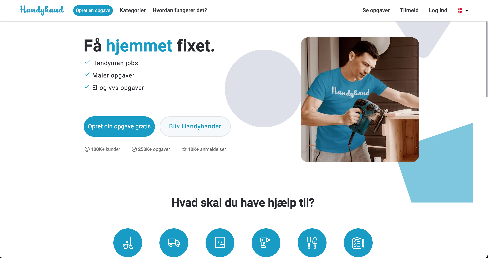
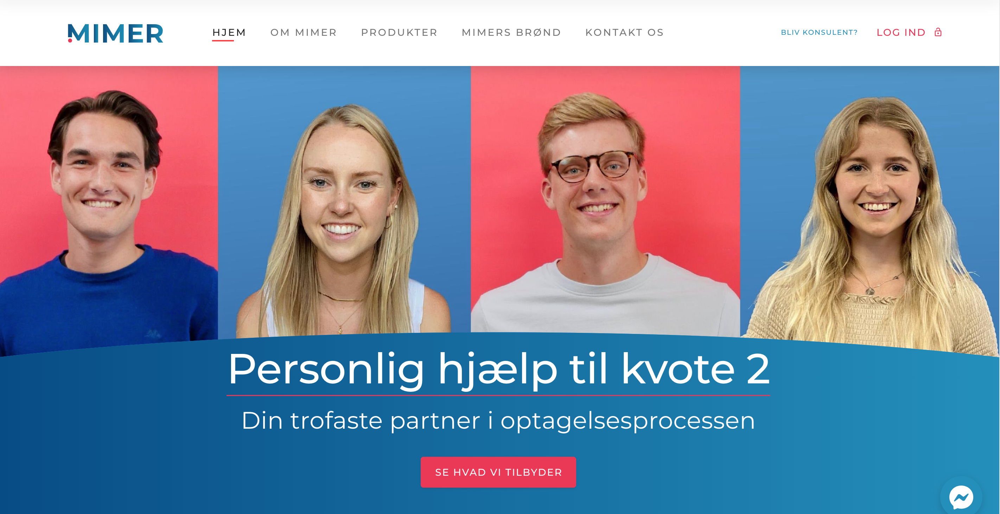

<!-- <link href="https://cdn.jsdelivr.net/npm/bootstrap@5.2.3/dist/css/bootstrap.min.css" rel="stylesheet" integrity="sha384-rbsA2VBKQhggwzxH7pPCaAqO46MgnOM80zW1RWuH61DGLwZJEdK2Kadq2F9CUG65" crossorigin="anonymous"> -->

# Incognito95
`UI / UX Designer & Web Developer`

I'm a UI / UX designer & web developer having worked in various companies over the years anywhere from startups to mid-size. Theirs a mix of projects on my profile, some are built from the ground up and others are built using frameworks by planning and designing all the way to solving real-life problems.

<h3>🧰 Languages & Tools</h3>

Here are the different websites that I helped to build at the different companies that I worked at:

  

    

        
    

    

       
    

    

       
    

  

 Here are some of my most proudest projects that I built at school (their a mix of both group and individual projects):

  

    

        
    

    

       
    

    

       
    

  

<h3>📊 Stats</h3>

